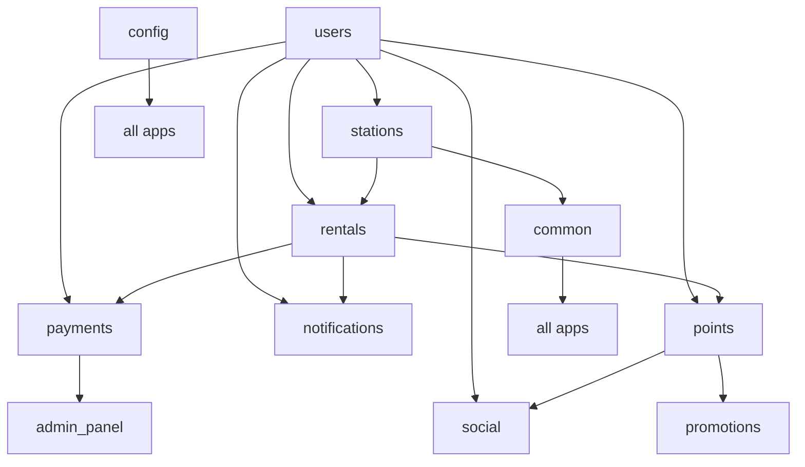

# 🔋 Charging Station Backend - Project Structure

## Django Apps Architecture

# 🗂️ Django App Structure with Table Grouping

## **users** → `/api/user/*`
```python
# models.py
User
UserProfile
UserKYC
UserDevice
UserPoints
UserAuditLog
```

## **stations** → `/api/station/*`
```python
# models.py
Station
StationSlot
StationAmenity
StationAmenityMapping
StationMedia
StationIssue
PowerBank
UserStationFavorite
```

## **rentals** → `/api/rental/*`
```python
# models.py
Rental
RentalPackage
RentalExtension
RentalLocation
RentalIssue
```

## **payments** → `/api/payment/*`
```python
# models.py
Wallet
WalletTransaction
Transaction
PaymentIntent
PaymentMethod
PaymentWebhook
Refund
```

## **notifications** → `/api/notification/*`
```python
# models.py
Notification
NotificationTemplate
NotificationRule
SMS_FCMLog
```

## **points** → `/api/points/*`
```python
# models.py
PointsTransaction
Referral
```

## **common** → Shared Utilities
```python
# models.py
MediaUpload
Country
```

## **config** → `/api/config/*`
```python
# models.py
AppConfig
AppVersion
AppUpdate
```

## **admin_panel** → `/api/admin/*`
```python
# models.py
AdminProfile
AdminActionLog
SystemLog
```

## **content** → `/api/content/*`
```python
# models.py
ContentPage
FAQ
ContactInfo
Banner
```

## **social** → `/api/social/*`
```python
# models.py
UserLeaderboard
Achievement
UserAchievement
```

## **promotions** → `/api/promotion/*`
```python
# models.py
Coupon
CouponUsage
```

## 🏗️ Project Structure with Models

```
powerbank_project/
├── users/                    # /api/user/*
│   ├── models.py            # User, UserProfile, UserKYC, UserDevice, UserPoints, UserAuditLog
│   ├── views.py
│   ├── serializers.py
│   └── urls.py
├── stations/                 # /api/station/*
│   ├── models.py            # Station, StationSlot, StationAmenity, StationAmenityMapping, 
│   │                        # StationMedia, StationIssue, PowerBank, UserStationFavorite
│   ├── views.py
│   ├── serializers.py
│   └── urls.py
├── rentals/                  # /api/rental/*
│   ├── models.py            # Rental, RentalPackage, RentalExtension, RentalLocation, RentalIssue
│   ├── views.py
│   ├── serializers.py
│   └── urls.py
├── payments/                 # /api/payment/*
│   ├── models.py            # Wallet, WalletTransaction, Transaction, PaymentIntent, 
│   │                        # PaymentMethod, PaymentWebhook, Refund
│   ├── views.py
│   ├── serializers.py
│   └── urls.py
├── notifications/            # /api/notification/*
│   ├── models.py            # Notification, NotificationTemplate, NotificationRule, SMS_FCMLog
│   ├── views.py
│   ├── serializers.py
│   └── urls.py
├── points/                   # /api/points/*
│   ├── models.py            # PointsTransaction, Referral
│   ├── views.py
│   ├── serializers.py
│   └── urls.py
├── common/                   # Shared utilities
│   ├── models.py            # MediaUpload, Country
│   ├── utils.py
│   ├── middleware.py
│   └── constants.py
├── config/                   # /api/config/*
│   ├── models.py            # AppConfig, AppVersion, AppUpdate
│   ├── views.py
│   ├── serializers.py
│   └── urls.py
├── admin_panel/              # /api/admin/*
│   ├── models.py            # AdminProfile, AdminActionLog, SystemLog
│   ├── views.py
│   ├── serializers.py
│   └── urls.py
├── content/                  # /api/content/*
│   ├── models.py            # ContentPage, FAQ, ContactInfo, Banner
│   ├── views.py
│   ├── serializers.py
│   └── urls.py
├── social/                   # /api/social/*
│   ├── models.py            # UserLeaderboard, Achievement, UserAchievement
│   ├── views.py
│   ├── serializers.py
│   └── urls.py
├── promotions/               # /api/promotion/*
│   ├── models.py            # Coupon, CouponUsage
│   ├── views.py
│   ├── serializers.py
│   └── urls.py
└── powerbank_project/
    ├── settings.py
    ├── urls.py
    └── wsgi.py
```

## 🔗 Inter-App Dependencies



## 📋 Key Considerations

1. **Foreign Key Relationships**: Ensure proper import paths for cross-app relationships
2. **Admin Configuration**: Register models in respective `admin.py` files
3. **Signal Handlers**: Place signals in the app where the main model resides
4. **API Versioning**: Consider adding versioning to your API endpoints
5. **Migration Management**: Each app will have its own migrations folder
6. **Utility Functions**: Common utilities should be in the `common` app

---

### Initial Setup
```bash
# Build and start all services
docker-compose up --build

# Run in detached mode
docker-compose up -d

# View logs
docker-compose logs -f
```

### Database Operations
```bash
# Run migrations
docker-compose exec web python manage.py migrate

# Create superuser
docker-compose exec web python manage.py createsuperuser

# Load initial data
docker-compose exec web python manage.py loaddata fixtures/initial_data.json
```

### Development Commands
```bash
# Access Django shell
docker-compose exec web python manage.py shell

# Run tests
docker-compose exec web python manage.py test

# Collect static files
docker-compose exec web python manage.py collectstatic --noinput

# Create new migration
docker-compose exec web python manage.py makemigrations

# Access PostgreSQL
docker-compose exec db psql -U postgres -d powerbank_db
```

### Celery & Background Tasks
```bash
# Start Celery worker
docker-compose exec celery celery -A api worker --loglevel=info

# Start Celery beat (scheduler)
docker-compose exec celery celery -A api beat --loglevel=info

# Monitor Celery tasks
docker-compose exec celery celery -A api flower
```

### Service Management
```bash
# Stop all services
docker-compose down

# Stop and remove volumes
docker-compose down -v

# Restart specific service
docker-compose restart web

# View service status
docker-compose ps

# Access container bash
docker-compose exec web bash
```

### Production Commands
```bash
# Build for production
docker-compose -f docker-compose.prod.yml up --build -d

# View production logs
docker-compose -f docker-compose.prod.yml logs -f web

# Backup database
docker-compose exec db pg_dump -U postgres powerbank_db > backup.sql
```

### Useful Development Aliases
```bash
# Add to your shell profile (.bashrc, .zshrc)
alias dcu="docker-compose up"
alias dcd="docker-compose down"
alias dcb="docker-compose up --build"
alias dcl="docker-compose logs -f"
alias dce="docker-compose exec"
alias dcm="docker-compose exec web python manage.py"
```

## Quick Start
1. Clone repository
2. Copy `.env.example` to `.env` and configure
3. Run `docker-compose up --build`
4. Access API at `http://localhost:8000/api/`
5. Admin panel at `http://localhost:8000/admin/`


